# User Journey — Путь пользователя через онбординг

**Версия:** 2.0 (после редизайна)
**Дата:** 17.01.2026
**Автор:** AI Assistant + Product Team

---

## 📖 Обзор

Этот документ описывает полный путь нового пользователя через онбординг Мира-бота — от первого касания до начала эмоционального диалога.

**Цель онбординга:**
- Собрать минимальную информацию о пользователе для персонализации
- Установить эмоциональное доверие
- Обеспечить плавный переход к полноценному диалогу
- Выдать 3 дня Premium для знакомства без ограничений

**Ключевые принципы:**
- **Один экран — одна мысль — одно действие**
- **Эмпатия важнее данных** — можно пропустить любой блок
- **Безопасность превыше всего** — кризисный протокол встроен в каждый шаг

---

## 🎯 Целевая аудитория

**Основная:**
- Женщины 25-45 лет
- Испытывают эмоциональные трудности (тревога, выгорание, отношения)
- Не готовы идти к психологу, но нужна поддержка
- Ценят приватность и конфиденциальность

**Барьеры при входе:**
- Страх осуждения
- Нежелание делиться личным сразу
- Скептицизм к ботам ("Это же не настоящий человек")
- Низкая мотивация заполнять анкеты

---

## 🗺️ Визуальная схема онбординга

```mermaid
flowchart TD
    Start([Пользователь нажимает /start]) --> CheckCompleted{Онбординг<br/>завершён?}

    CheckCompleted -->|Да| WelcomeBack[Приветствие<br/>по времени суток<br/>+<br/>вопрос о настроении]
    CheckCompleted -->|Нет| TimeGreeting[Персонализированное<br/>приветствие<br/>по времени суток]

    WelcomeBack --> EndFlow([Переход к диалогу])

    TimeGreeting --> Intro[Я Мира 💛<br/>Я здесь чтобы выслушать]
    Intro --> AskName[Как к тебе<br/>обращаться?]
    AskName --> ReceiveName[Пользователь<br/>вводит имя]

    ReceiveName --> CrisisCheck1{Кризисные<br/>маркеры?}
    CrisisCheck1 -->|Да high/critical| EmergencyMsg1[Экстренное<br/>сообщение<br/>с хелплайном]
    EmergencyMsg1 --> EndCrisis1([Выход из онбординга<br/>→ кризисный диалог])

    CrisisCheck1 -->|Нет| ConfirmName[Подтверди имя:<br/>кнопки Да/Изменить]
    ConfirmName --> ConfirmYes{Подтвердил?}

    ConfirmYes -->|Изменить| AskName
    ConfirmYes -->|Да| Progress25[🌟⭐⭐⭐ 25%]

    Progress25 --> Privacy[Всё что ты скажешь<br/>зашифровано 🔒]
    Privacy --> AskProblem[Что беспокоит<br/>прямо сейчас?<br/>Кнопки с вариантами]

    AskProblem --> SelectProblem[Выбор проблемы:<br/>тревога/отношения/<br/>выгорание/вина/etc]
    SelectProblem --> Progress50[🌟🌟⭐⭐ 50%]

    Progress50 --> AskSocial[Расскажи о себе<br/>возраст/город/<br/>работа/хобби<br/>в свободной форме]

    AskSocial --> ReceiveSocial[Пользователь<br/>вводит текст]
    ReceiveSocial --> CrisisCheck2{Кризисные<br/>маркеры?}

    CrisisCheck2 -->|Да high/critical| EmergencyMsg2[Экстренное<br/>сообщение]
    EmergencyMsg2 --> EndCrisis2([Выход → кризисный диалог])

    CrisisCheck2 -->|Нет| Progress75[🌟🌟🌟⭐ 75%]
    Progress75 --> AskFamily[Как у тебя<br/>на личном фронте?<br/>Кнопки статусов]

    AskFamily --> FamilyChoice{Выбор<br/>статуса}
    FamilyChoice -->|Замужем/<br/>В отношениях| AskDetails[Расскажи подробнее:<br/>партнёр/дети?<br/>+ кнопка Пропустить]
    FamilyChoice -->|Свободна/<br/>Всё сложно| SkipFamily1[Понятно 💛]
    FamilyChoice -->|Расскажу позже| SkipFamily2[Хорошо, расскажешь<br/>когда захочешь 💛<br/>skip_count++]

    AskDetails --> DetailChoice{Ввод деталей<br/>или Пропустить}
    DetailChoice -->|Пропустить| SkipDetails[skip_count++]
    DetailChoice -->|Ввод текста| ReceiveDetails[Получаем детали<br/>о семье]

    ReceiveDetails --> CrisisCheck3{Кризисные<br/>маркеры?}
    CrisisCheck3 -->|Да high/critical| EmergencyMsg3[Экстренное<br/>сообщение]
    EmergencyMsg3 --> EndCrisis3([Выход → кризисный диалог])

    CrisisCheck3 -->|Нет| FinalCheck
    SkipDetails --> FinalCheck
    SkipFamily1 --> FinalCheck
    SkipFamily2 --> FinalCheck

    FinalCheck{skip_count<br/>>= 2?}

    FinalCheck -->|Да| MinimalInfo[Я понимаю —<br/>непросто делиться<br/>личным сразу 💛<br/>Узнаем друг друга<br/>постепенно]
    FinalCheck -->|Нет| Achievement[🏆 Поздравляю!<br/>Ты завершила<br/>знакомство!]

    Achievement --> GiftPremium[Дарю 3 дня<br/>без ограничений 💛]
    MinimalInfo --> GiftPremium

    GiftPremium --> Progress100[✨ 100% ✨]
    Progress100 --> FinalQuestion[Что у тебя<br/>сейчас на душе?]
    FinalQuestion --> EndFlow

    style Start fill:#e1f5ff
    style EndFlow fill:#c8e6c9
    style EndCrisis1 fill:#ffccbc
    style EndCrisis2 fill:#ffccbc
    style EndCrisis3 fill:#ffccbc
    style EmergencyMsg1 fill:#ff5252,color:#fff
    style EmergencyMsg2 fill:#ff5252,color:#fff
    style EmergencyMsg3 fill:#ff5252,color:#fff
    style GiftPremium fill:#fff9c4
    style Achievement fill:#fff9c4
```



---

## 📝 Детальное описание шагов

### 0️⃣ Точка входа: /start

**Действие:** Пользователь нажимает кнопку "Начать" в Telegram или вводит `/start`

**Логика:**
- Проверяем флаг `onboarding_completed` в БД
- Если `True` → пропускаем онбординг, показываем приветствие
- Если `False` → начинаем онбординг с шага 1

**Событие:** `onboarding_started` логируется в `onboarding_events`

---

### 1️⃣ Приветствие по времени суток

**Текст (зависит от времени):**

```
[Утро 5-12] Доброе утро! ☀️ Я Мира 💛
[День 12-18] Добрый день! 🌤 Я Мира 💛
[Вечер 18-23] Добрый вечер! 🌙 Я Мира 💛
[Ночь 23-5] Привет! 🌜 Ты не спишь? Я Мира 💛
```

**Пауза:** 1 секунда (typing indicator)

**Психология:** Создаёт ощущение внимательности и эмпатии. Ночное сообщение особенно важно для пользователей в кризисе.

---

### 2️⃣ Знакомство

**Текст:**
```
Я здесь, чтобы просто выслушать — без осуждения.

Как я могу к тебе обращаться?
```

**Состояние:** `WAITING_NAME`

**Ожидание:** Свободный ввод текста (имя, никнейм, любое обращение)

**Валидация:**
- Длина 1-50 символов
- Проверка на кризисные маркеры (суицид, насилие)
- Если кризис `high/critical` → прерываем онбординг → экстренное сообщение

**Событие:** `name_entered`

---

### 3️⃣ Подтверждение имени

**Текст:**
```
Приятно познакомиться, {имя}! 💛

Всё верно?
```

**Кнопки:**
- ✅ **Да, всё верно**
- ✏️ **Хочу изменить**

**Логика:**
- Если "Изменить" → возврат к шагу 2
- Если "Да" → сохраняем в `display_name`, переход к шагу 4

**Событие:** `name_confirmed`

---

### 4️⃣ Прогресс и приватность

**Текст:**
```
🌟⭐⭐⭐ 25%

{имя}, наш чат **полностью зашифрован** 🔒

Никто не увидит наши разговоры. Только ты и я.
```

**Пауза:** 1.5 секунды

---

### 5️⃣ Выбор проблемы

**Текст:**
```
Что беспокоит прямо сейчас?
```

**Кнопки (2 колонки):**
- 😰 **Тревога и страхи**
- 💔 **Отношения**
- 😔 **Выгорание**
- 😣 **Чувство вины**
- 🌧 **Грусть и одиночество**
- 🔥 **Злость**

**Логика:**
- Сохраняем выбранную проблему в `context.user_data['selected_problem']`
- Это влияет на системный промпт Claude в дальнейшем диалоге

**Событие:** `problem_selected` с данными `{"problem": "anxiety"}`

**Состояние:** → `SOCIAL_PORTRAIT`

---

### 6️⃣ Прогресс 50%

**Текст:**
```
🌟🌟⭐⭐ 50%
```

---

### 7️⃣ Социальный портрет (свободная форма)

**Текст:**
```
Расскажи немного о себе: *сколько тебе лет, из какого города и чем занимаешься?*

Если есть увлечения — тоже делись 💛
```

**Ожидание:** Свободный ввод текста

**Логика:**
- AI-парсинг через Claude: извлекаем `age`, `city`, `occupation`, `hobbies`
- Сохраняем в таблицу `user_profiles`
- Если парсинг не удался — ничего страшного, сохраняем как есть
- **Кризисная проверка:** если уровень `high/critical` → прерываем → экстренное сообщение

**Событие:** `social_portrait_provided`

**Состояние:** → `FAMILY_STATUS`

---

### 8️⃣ Прогресс 75%

**Текст:**
```
🌟🌟🌟⭐ 75%
```

---

### 9️⃣ Вопрос о семье (кнопки)

**Текст:**
```
А как у тебя на личном фронте?
```

**Кнопки (2 колонки):**
- 💍 **Замужем**
- ❤️ **В отношениях**
- 🌷 **Свободна**
- 😅 **Всё сложно**
- ↪️ **Расскажу позже**

**Логика:**
- Если "Замужем" или "В отношениях" → переход к шагу 10 (детали)
- Если "Свободна" или "Всё сложно" → переход к финалу (шаг 12)
- Если "Расскажу позже" → `skip_count++` → переход к финалу

**Событие:** `family_status_selected` с данными `{"status": "married"}`

**Состояние:** → `FAMILY_DETAILS` (если замужем/в отношениях)

---

### 🔟 Детали о семье (опционально)

**Текст:**
```
Расскажи чуть подробнее: *как зовут твоего партнёра? Есть ли дети?*

Если не хочешь делиться сейчас — нажми "Пропустить" 🌷
```

**Кнопки:**
- ↪️ **Пропустить**

**Ожидание:** Свободный ввод текста ИЛИ нажатие "Пропустить"

**Логика:**
- Если "Пропустить" → `skip_count++` → переход к финалу
- Если текст → AI-парсинг: `partner_name`, `has_children`, `children_count`, `children` (JSONB)
- **Кризисная проверка:** насилие в отношениях, проблемы с детьми
- Сохраняем в `user_profiles`

**Событие:** `family_details_provided` или `family_details_skipped`

---

### 1️⃣1️⃣ Проверка количества пропусков

**Логика:**
```python
if context.user_data.get('skip_count', 0) >= 2:
    # Переход к эмпатичному завершению
    show_minimal_info_message()
else:
    # Переход к стандартному завершению
    show_achievement_message()
```

**Два сценария:**

#### Сценарий A: Пользователь пропустил 2+ раза
```
{имя}, я понимаю — иногда непросто делиться личным сразу 💛

Это нормально. Мы узнаем друг друга постепенно, в своём темпе.

Хочу, чтобы нас ничего не прерывало — дарю тебе **3 дня без ограничений** 💛

Что у тебя сейчас на душе?
```

**Флаг:** `completed_with_minimal_info: True` в событии

---

#### Сценарий B: Пользователь поделился информацией
```
🏆 **Поздравляю!** Ты завершила знакомство!

Хочу, чтобы нас ничего не прерывало — дарю тебе **3 дня без ограничений** 💛

✨ Знакомство завершено: 100% ✨

Что у тебя сейчас на душе?
```

---

### 1️⃣2️⃣ Завершение онбординга

**Действия в БД:**
1. Устанавливаем `user.onboarding_completed = True`
2. Сохраняем `user.display_name = {имя}`
3. Создаём подписку Premium на 3 дня: `trial_until = now() + 3 days`
4. Логируем событие: `onboarding_completed` с полными данными

**Событие:**
```json
{
  "event_name": "onboarding_completed",
  "event_data": {
    "name": "Люся",
    "selected_problem": "anxiety",
    "social_info": "34 года, Москва, маркетолог",
    "family_status": "married",
    "skip_count": 0,
    "completed_with_minimal_info": false,
    "premium_granted": true,
    "duration_seconds": 180
  }
}
```

**Состояние:** → `ConversationHandler.END`

**Следующий шаг:** Пользователь может сразу написать о своих чувствах → запускается основной диалоговый флоу с Claude

---

## 🚨 Кризисный протокол

### Точки проверки

Кризисные маркеры проверяются в **3 местах:**

1. **При вводе имени** (шаг 2)
2. **При описании социального портрета** (шаг 7)
3. **При описании семьи** (шаг 10)

### Уровни кризиса

**Low/Medium:**
- Продолжаем онбординг
- Помечаем в логах: `crisis_detected: true`

**High/Critical:**
- Прерываем онбординг: `return ConversationHandler.END`
- Отправляем экстренное сообщение с хелплайнами:
  - Suicide hotline: +7 (495) 051
  - Violence hotline: 8-800-7000-600
- Переход к кризисному диалогу (отдельный флоу)

### Пример кризисного сообщения

```
{имя}, я вижу что тебе сейчас очень тяжело.

Важно: если ты думаешь о причинении вреда себе — пожалуйста, позвони:
📞 Телефон доверия: +7 (495) 051 (круглосуточно)

Я здесь и готова поддержать. Но в такой ситуации важно поговорить с человеком, который может оказать профессиональную помощь.

Ты не одна 💛
```

---

## 📊 Метрики онбординга

### Completion Rate

**Формула:**
```
CR = (завершили онбординг / начали онбординг) × 100%
```

**Текущая цель:** >70%

**Точки выхода:**
- После имени (шаг 2)
- После выбора проблемы (шаг 5)
- После социального портрета (шаг 7)
- При кризисной ситуации

**SQL запрос:**
```sql
SELECT
  COUNT(DISTINCT CASE WHEN event_name = 'onboarding_started' THEN user_id END) as started,
  COUNT(DISTINCT CASE WHEN event_name = 'onboarding_completed' THEN user_id END) as completed,
  ROUND(100.0 * COUNT(DISTINCT CASE WHEN event_name = 'onboarding_completed' THEN user_id END) /
        COUNT(DISTINCT CASE WHEN event_name = 'onboarding_started' THEN user_id END), 2) as completion_rate
FROM onboarding_events
WHERE created_at >= NOW() - INTERVAL '7 days';
```

---

### Time to Complete

**Формула:**
```
TTC = timestamp(onboarding_completed) - timestamp(onboarding_started)
```

**Цель:** <3 минуты (медиана)

**Запрос:**
```sql
SELECT
  PERCENTILE_CONT(0.5) WITHIN GROUP (ORDER BY duration_seconds) as median_duration,
  AVG(duration_seconds) as avg_duration,
  MIN(duration_seconds) as min_duration,
  MAX(duration_seconds) as max_duration
FROM (
  SELECT
    user_id,
    EXTRACT(EPOCH FROM (
      MAX(CASE WHEN event_name = 'onboarding_completed' THEN created_at END) -
      MIN(CASE WHEN event_name = 'onboarding_started' THEN created_at END)
    )) as duration_seconds
  FROM onboarding_events
  WHERE created_at >= NOW() - INTERVAL '7 days'
  GROUP BY user_id
  HAVING COUNT(DISTINCT event_name) >= 2
) durations;
```

---

### Skip Rate

**Формула:**
```
SR = (пользователи со skip_count >= 2 / все завершившие) × 100%
```

**Цель:** Следить за динамикой (нет жёсткого лимита)

**Запрос:**
```sql
SELECT
  COUNT(*) FILTER (WHERE (event_data->>'skip_count')::int >= 2) as skipped_multiple,
  COUNT(*) as total_completed,
  ROUND(100.0 * COUNT(*) FILTER (WHERE (event_data->>'skip_count')::int >= 2) / COUNT(*), 2) as skip_rate
FROM onboarding_events
WHERE event_name = 'onboarding_completed'
  AND created_at >= NOW() - INTERVAL '7 days';
```

---

### Crisis Detection Rate

**Формула:**
```
CDR = (количество обнаруженных кризисов / начали онбординг) × 100%
```

**Запрос:**
```sql
SELECT
  COUNT(*) FILTER (WHERE event_data->>'crisis_detected' = 'true') as crises_detected,
  COUNT(DISTINCT user_id) as total_users,
  ROUND(100.0 * COUNT(*) FILTER (WHERE event_data->>'crisis_detected' = 'true') / COUNT(DISTINCT user_id), 2) as crisis_rate
FROM onboarding_events
WHERE created_at >= NOW() - INTERVAL '7 days';
```

---

## 🔄 Возврат незавершивших (Reminders)

### Логика напоминаний

**Условие:**
- `onboarding_completed = False`
- Прошло >= 24 часа с `onboarding_started`
- Событие `onboarding_reminder_sent` ещё не логировалось

**Текст сообщения:**
```
Привет, {имя}! 💛 Это Мира.

Мы не закончили знакомство. Готова продолжить?

Просто напиши /start и продолжим с того места, где остановились.
```

**Частота:** 1 раз (не спамим)

**Реализация:** Scheduler job каждый час проверяет таблицу `users` и `onboarding_events`

**Код:** `services/scheduler.py:send_onboarding_reminders()`

---

## 🎨 UX/UI Guidelines

### Typing Indicators

**Используем везде:**
```python
await send_with_typing(update, text, delay=1.0)
```

**Паузы:**
- Короткие сообщения (1-2 строки): 0.5-1 сек
- Средние сообщения (3-5 строк): 1-1.5 сек
- Длинные сообщения: 1.5-2 сек

**Психология:** Создаёт ощущение живого человека, снижает тревожность

---

### Emoji Usage

**Правило:** Умеренно, но стабильно

**Основные эмодзи:**
- 💛 — тепло, поддержка (используем часто)
- 🌷 — деликатность (для чувствительных тем)
- 🔒 — приватность
- ☀️🌤🌙🌜 — время суток
- 🌟⭐ — прогресс
- 🏆 — достижение

**Не используем:**
- 😂😅 — юмор (только в крайних случаях)
- ❤️🔥 — слишком эмоционально

---

### Button Design

**Количество кнопок:**
- Максимум 6 кнопок в сетке
- Оптимально: 2-4 кнопки

**Расположение:**
- 2 колонки для 4-6 кнопок
- 1 колонка для 2-3 длинных текстов

**Текст:**
- Короткий (1-4 слова)
- Ясный, без жаргона
- Начинается с эмодзи для визуального разделения

---

### Markdown Formatting

**Используем:**
- **Жирный** — для ключевых моментов ("3 дня без ограничений")
- *Курсив* — для вопросов, цитат

**Не используем:**
- `Моноширинный` — это не техническая документация
- __Подчёркивание__ — нет в Telegram

---

## 🧪 A/B Testing (Future)

### Гипотезы для тестирования

1. **Длина онбординга:**
   - Вариант A: 4 шага (текущий)
   - Вариант B: 3 шага (убрать социальный портрет)
   - Метрика: Completion Rate

2. **Время предложения Premium:**
   - Вариант A: В конце онбординга (текущий)
   - Вариант B: После первого глубокого ответа в диалоге
   - Метрика: Premium Activation Rate

3. **Персонализация приветствия:**
   - Вариант A: По времени суток (текущий)
   - Вариант B: По времени суток + погода в городе
   - Метрика: Engagement в первом сообщении

---

## 📚 Связанные документы

- [TODO_ONBOARDING.md](./TODO_ONBOARDING.md) — список задач
- [ONBOARDING_TESTING_GUIDE.md](./ONBOARDING_TESTING_GUIDE.md) — руководство по тестированию
- [../CHANGELOG.md](../CHANGELOG.md) — история изменений
- [../../ai/prompts/system_prompt.py](../../ai/prompts/system_prompt.py) — промпт для Claude

---

## ✅ Checklist для команды

### Перед запуском новых изменений:

- [ ] Обновлена схема Mermaid в этом документе
- [ ] Обновлён TODO_ONBOARDING.md (отметить выполненные задачи)
- [ ] Проведено тестирование на локальном окружении
- [ ] Проверены все точки кризисного протокола
- [ ] Обновлён CHANGELOG.md
- [ ] Деплой на сервер + проверка логов
- [ ] Мониторинг метрик первые 24 часа

---

**Последнее обновление:** 17.01.2026
**Версия онбординга:** 2.0
**Completion Rate (текущий):** ~80% (по TODO_ONBOARDING.md)
